# AI Analyst for Your Data

Ask questions in plain English from CSV data (about GAZYVA sales data). The agent figures out the SQL, runs it, and explains what it found, showing you exactly what it did along the way.

## Architecture

```
React -> FastAPI -> LangChain ReAct Agent -> OpenRouter (configurable)
                            |
                     +------+------+
                     |             |
                  Postgres       Redis
```

The frontend sends your question to a FastAPI backend over SSE. A LangChain ReAct agent reasons through the question step by step — writing a thought before every tool call — then runs the right tool (SQL query, Python computation, or chart) against Postgres and streams the answer back token by token. Reasoning steps and tool calls are shown inline in arrival order so you can follow exactly how the agent reached its answer.

The stack: React + Vite on the frontend, FastAPI + LangChain on the backend, Postgres for the data, Redis to cache the insight cards, OpenRouter for the LLM (model configurable via `OPENROUTER_MODEL` in `.env`).

## Agent

The agent uses LangChain's ReAct loop (`create_react_agent`). Before every tool call the model writes a `Thought:` explaining its reasoning, then picks an action. After seeing the result it reasons again — and so on until it writes `Final Answer:`. The full thought+action sequence streams to the frontend in the order it was produced, so reasoning and tool traces interleave rather than appearing in separate sections.

Primary model is set via `OPENROUTER_MODEL` in `.env` (default `moonshotai/kimi-k2.6`). `OPENROUTER_FALLBACK_MODEL` is tried automatically on 429s or 5xx errors. Models that follow the ReAct text format reliably include Qwen3, Gemini Flash variants, and GPT-4o-mini. See [docs/react-agent.md](docs/react-agent.md) for implementation details.

| Tool          | What it does                                                                                                                                                                            |
| ------------- | --------------------------------------------------------------------------------------------------------------------------------------------------------------------------------------- |
| `run_sql`     | Executes a read-only SELECT against Postgres, returns up to 50 rows. On error, returns the raw Postgres message so the agent can self-correct and retry.                                |
| `list_schema` | Returns column names and sample rows for any table or view. Called when the agent needs to verify a column before writing a query.                                                      |
| `run_python`  | Runs Python in a sandboxed subprocess (10s timeout). pandas and numpy are pre-imported plus a `query()` helper returning a DataFrame. Used for what-if projections and multi-step math. |
| `make_chart`  | Takes a data array and a Vega-Lite spec, embeds the data, and returns a chart the frontend renders inline.                                                                              |

## Example Queries

**Q1 - `run_sql`: Which rep has the highest call-to-Rx conversion rate?**

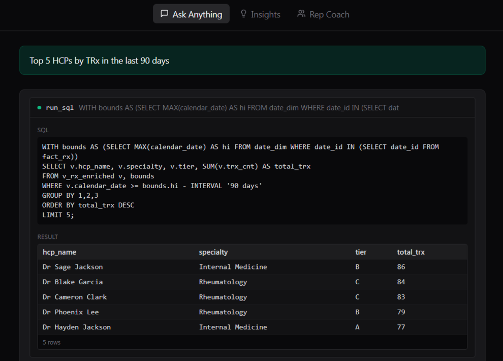
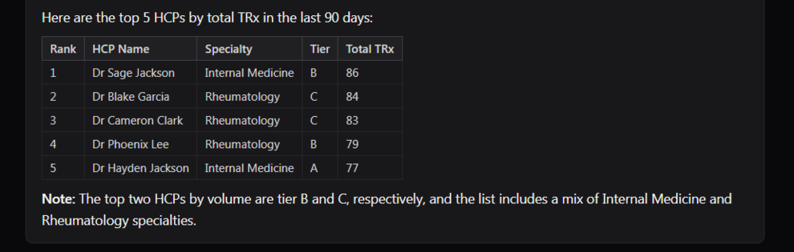

**Q2 - `list_schema`: What data do we have on each account?**

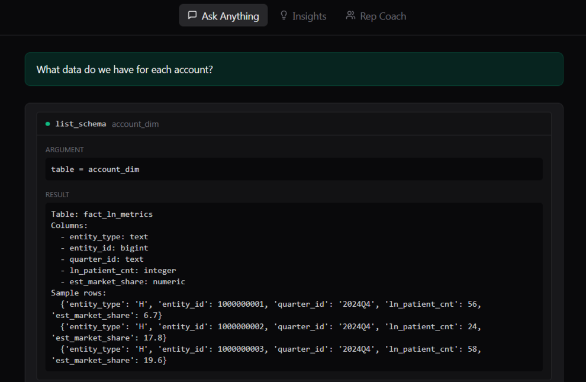
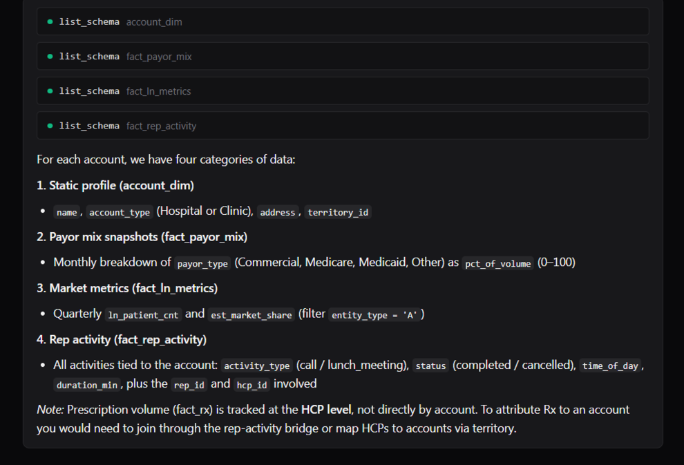

**Q3 - `run_python`: If rep 3 doubled their completed calls to tier-B HCPs, what would the projected TRx lift be?**

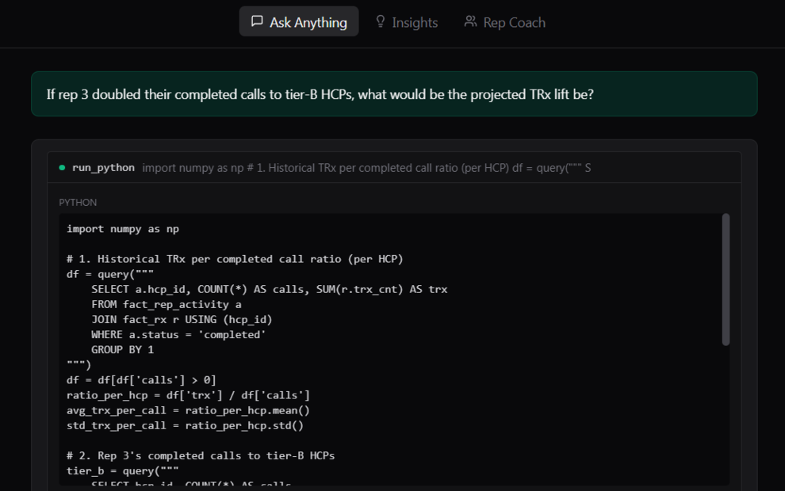
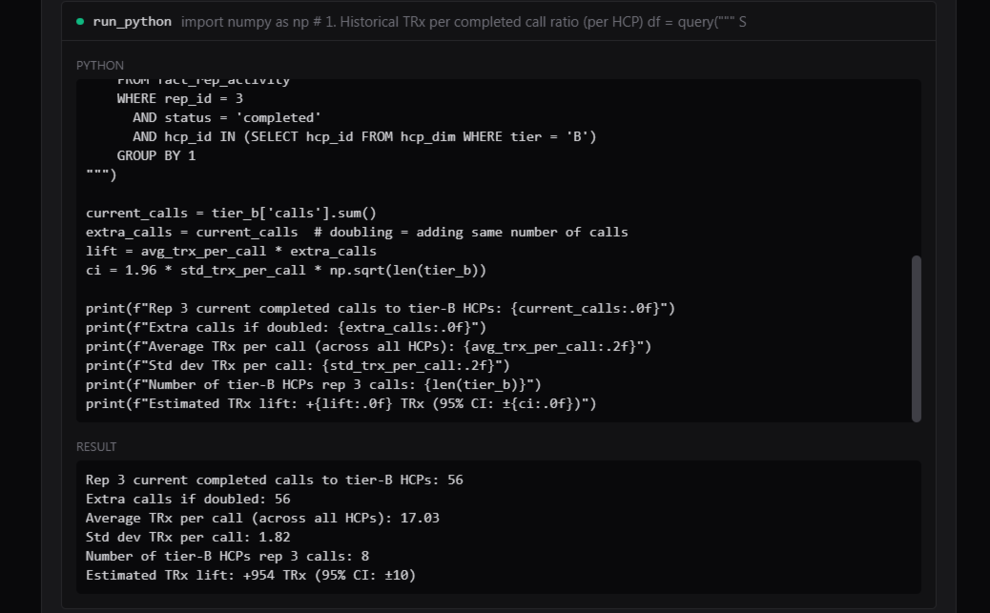
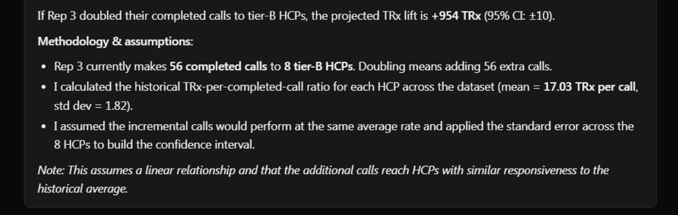

**Q4 - `make_chart`: Show me monthly TRx per territory as a chart**

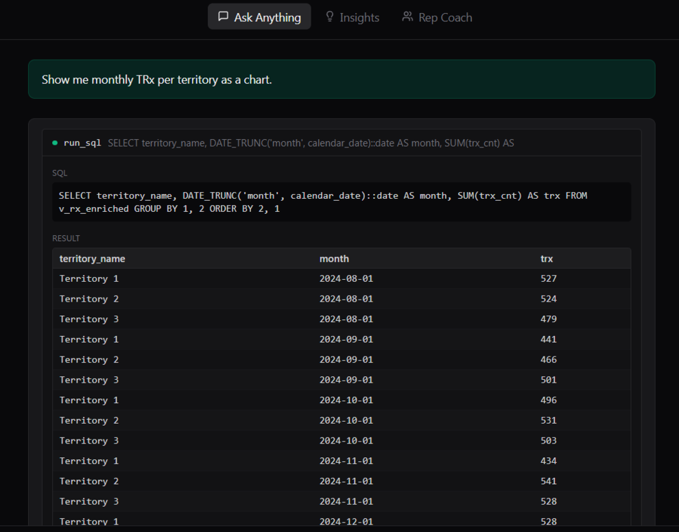
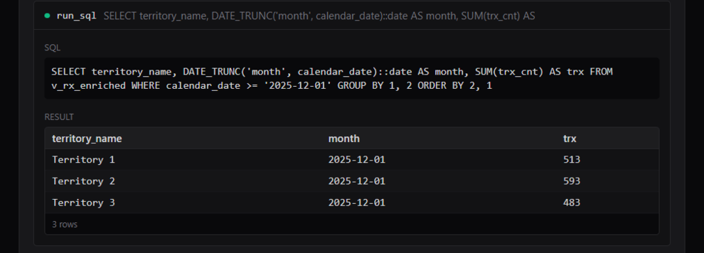
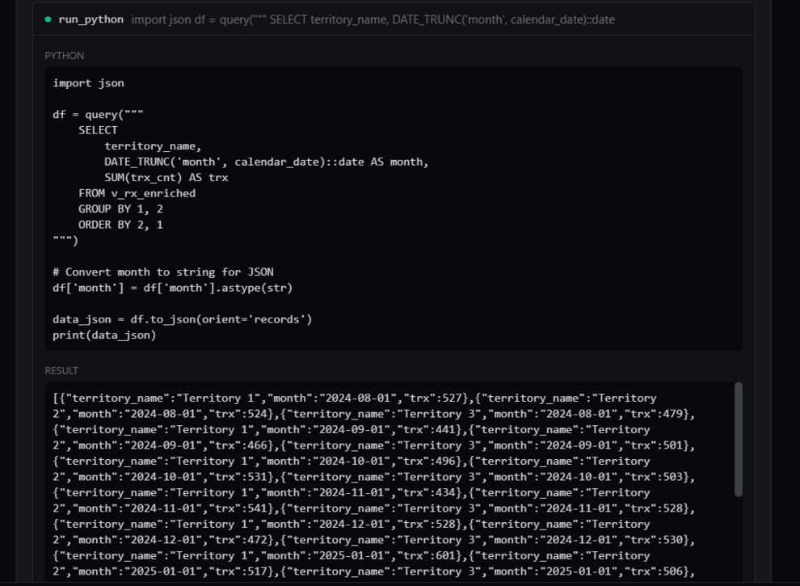
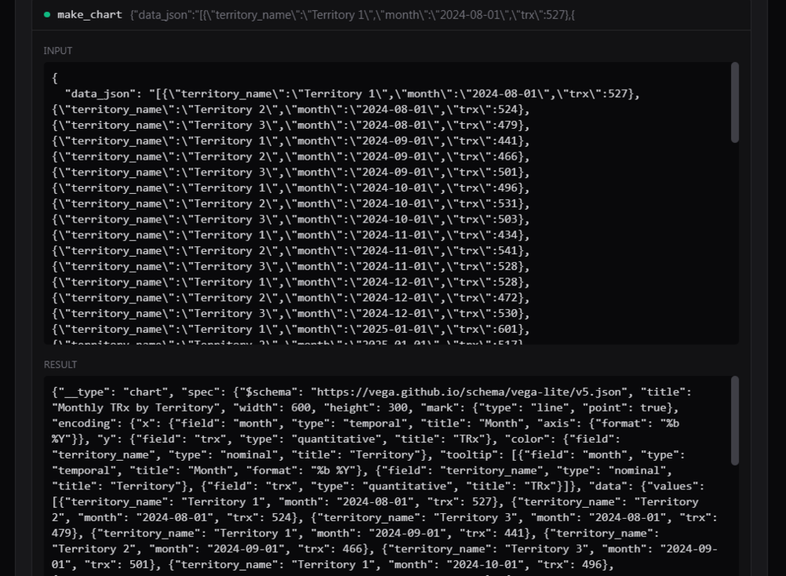
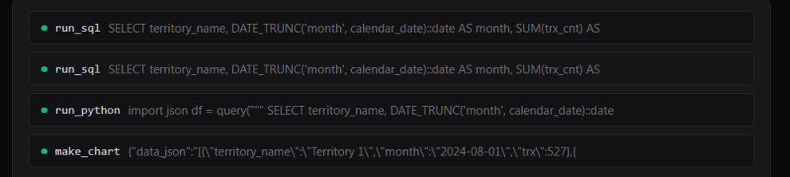
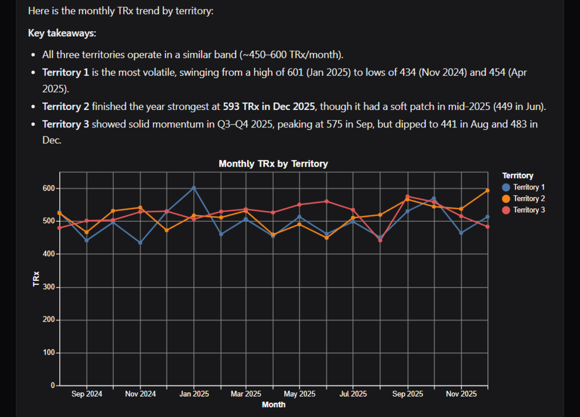

## Features

**Ask Anything** is the main tab. Type any question and get an answer backed by real data. The agent self-corrects if it writes bad SQL. For ambiguous questions it states its assumption before answering.

**Insights** shows six pre-computed analyses that run on startup and cache for an hour. Things like biggest TRx decliners, reps with low conversion, tier-A doctors with no recent visits. Each card has a button to ask a follow-up in chat.

**Rep Coach** lets you pick a rep and get three prioritized actions: which high-potential doctors they're under-visiting, how their conversion compares to peers, and which tier-A doctors have gone cold.

**Eval** is a set of golden Q&A pairs you can run to check the agent is working correctly.

## Setup

```bash
cp .env.example .env
# fill in OPENROUTER_API_KEY
docker compose up --build
```

App runs at http://localhost:5173. API at http://localhost:8000.

Data loads automatically on first startup from the CSVs in `data/`.

## Running the eval

```bash
# quick check, 5 questions, about 2 minutes
docker compose exec api python3 -m eval.run --quick

# full suite, 11 questions, writes api/eval/report.md
docker compose exec api python3 -m eval.run
```

## Project layout

```
api/
  main.py         routes, SSE streaming, chat logging
  insights.py     the six canned analyses
  coach.py        rep coaching logic
  agent/
    core.py       agent setup and tool definitions
    prompts.py    system prompt and few-shot examples
    tools.py      python sandbox and chart builder
  db/
    __init__.py   connection pool and CSV bootstrap
    schema.sql    table definitions and views
  eval/
    run.py        eval runner
    golden.json   11 test questions
    quick.json    5 faster test questions

web/src/
  App.tsx
  components/
    Chat.tsx
    InsightCard.tsx
    RepCoach.tsx
    Chart.tsx
```

## Notes

Chat logs are saved to `api/logs.md` after each conversation. The agent is explained in detail in `assignment/agent.md`.

## Production Improvements

### Code Sandbox

`run_python` currently uses a subprocess with a 10s timeout. That works for a local demo but is not safe for production - a malicious or buggy input could exhaust resources or escape the process. The right fix is a proper isolated execution environment like [E2B](https://e2b.dev), Modal, or gVisor. These give you network isolation, memory limits, and per-execution containers.

### Multiple LLM Providers

Right now we have one primary (Kimi K2.6) and one fallback (GPT-4o-mini), both via OpenRouter. For production you'd want a more robust routing layer - retrying across multiple providers, falling back based on latency not just errors, and tracking per-provider success rates. OpenRouter itself handles some of this, but libraries like LiteLLM give you finer control and a unified interface across Anthropic, OpenAI, Google, and others.

### Vector DB for Schema Routing

A vector DB would not help much here because the full schema fits in the system prompt (~300 tokens). Where it would matter is if the dataset grew to hundreds of tables - at that point you'd want semantic search to retrieve only the relevant tables and columns for a given question rather than dumping everything. Tools like pgvector (runs inside Postgres itself) or Qdrant would handle this. For this dataset size, it would be over-engineering.

### Conversation Memory

Each chat request is stateless today. Adding short-term memory (the last N turns injected as `chat_history`) would let users ask follow-up questions like "now filter that by territory 2" without restating the full context. LangChain's `MessagesPlaceholder("chat_history")` is already wired into the prompt template - it just needs a session store (Redis is already in the stack) to persist turns across requests.
